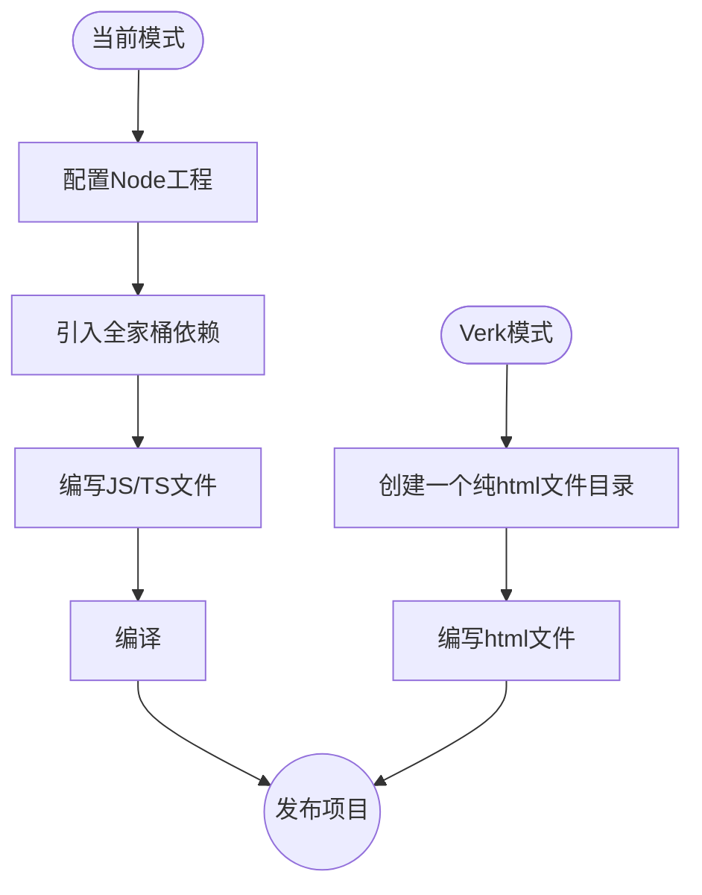
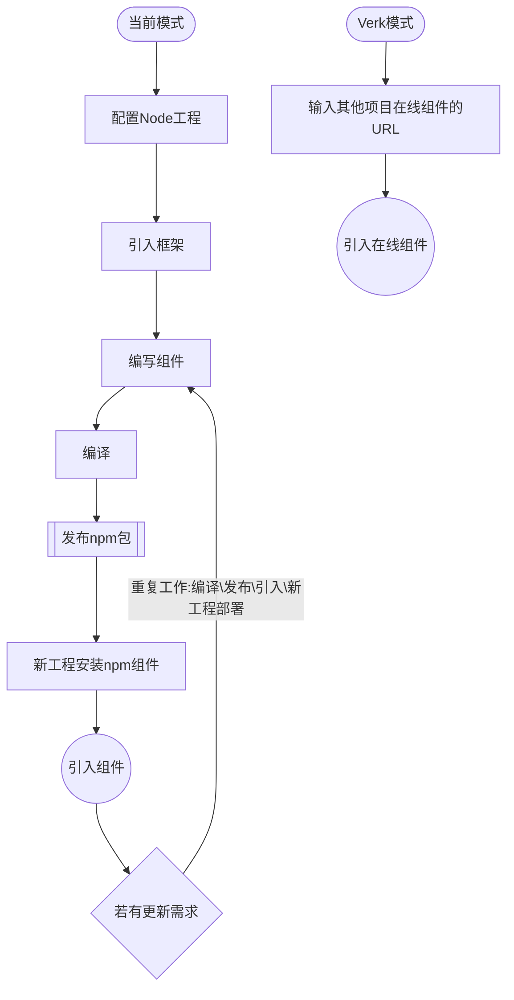

# Verk文档网站作为组件引入

Verk 是一个基于 Web-Components 的前端(`微服务`)框架。

首先恭喜你找到 [Verk]，它立志提供一个全新的 web 开发方式。

## Verk 立志于解决以下问题

- **前端巨石应用:**  [Verk]是一个天生的前端微服务框架.
- **工程复杂度随迭代增高，处于失控边缘徘徊:**  [Verk]的设计模式使得我们很容易编写复杂度内聚的工程.
- **前端编译、工程配置繁碎:**  [Verk]不需要编译，不需要配置工程.
- **跨工程复用组件，频繁发包:**  [Verk]可以直接使用其他在线[Verk]工程的模块、组件.
- **非常多重复的代码量:**  [Verk]可以直接编写HTML标签完成大部分有状态需求的业务逻辑.
- **状态管理过度封装，调试困难:**  [Verk]直接在标签中嵌入状态管理，并且所有状态都是实时响应的，只有遇到了性能瓶颈时才需要稍加约束.
- **单页面应用切换为多页面应用有一定的工作量:**  [Verk]是纯html，天生为多页面应用，可以轻松编写多页面混合单页面应用的工程
- **编译后JS资源庞大，即便做了代码拆分:**  [Verk]天生确保代码拆分，虽然牺牲了代码bundle的加载优势，但是换来了其他更多的特性；现实情况是，很少有应用因为代码拆分的多导致整体性能下降，首屏的性能大部分在于必要依赖过多。


我们看看Verk和当前开发方式的区别:

### 项目开发




### 跨项目公用模块/组件开发

跨项目模块本意是为了节省工作量，让多个项目减少重复开发工作，但是因为需要编译的原因，我们需要重复的做：编译\发布\引入\新工程部署的工作。

而在 [Verk] 中，我们仅仅需要引入一个其他工程的组件URL即可，若要做版本管理，仅需要使用不同的URL。

下面是一个两个流程对比的图示：



### 前端微服务

前端微服务是现在前端讨论的一个热门话题，但是真正实施落地的非常少。追其原因是前端随迭代变得越发复杂，因为有了编译这么一层级，导致于做前端微服务需要考虑的点非常多，其关键的问题在于：
 - 如何公用依赖（减少代码请求量）
 - 如何独立发布部署
 - 如何复用模块
 - 如何拆分微服务粒度，是组件级别还是模块级别

以上所有疑点难点，[Verk]在结构设计上就提供了解决方案。

# 安装

我们仅推荐一种方式安装，就是在**html文件底部**引入 `<script>` 标签：

```html::{showView:false, style:"height:80px;"}
<script src="https://unpkg.com/verk@0.1.0/umd/index.js"></script>
```

当然，我们如果希望使用自己的CDN，可以将 verk.js 下载到工程中，使用相对路径引入:
```html::{showView:false, style:"height:80px;"}
<script src="./pkg/verk.js"></script>
```

[Verk] 主张所有src、href路径都以 `./` 开头，以相对路径引入，这在后文使用组件的篇章会有解释。


## 创建工程

[Verk] 的工程就是一个普通的文件夹，不需要 nodejs，不需要安装 npm，回归网页元素的组织形式，一个 Verk 工程应该是这样：

```text::{showView:false, style:"height: 400px"}
- project/
   - .gitignore
   - pkg
      - verk.js
      - rx.js
      - pdf-editor.js
   - index.html
   - components/
      - nav.html
      - tabbar.html
      - layout.html
      - assets/
        - logo.svg
        - banner.png
   - pages/
     - home.html
     - user.html
     - assets/
        - start.svg
        - avator.png
```

我们可以看到，没有js和css文件，因为我们建议把业务js、css直接内联写在html中，而且若用到第三方JS库，直接将其js代码放在工程pkg文件夹中。

[Verk] 没有打包过程，每个html文件即可以是页面，也可以是组件。

## 启动工程

由于没有编译过程，我们仅需要将 index.html 文件拖入浏览器中即可。

当然，如果我们需要开发中同步刷新浏览器，我们可以随便使用一个 server 库启动工程目录:

```sh::{style:"height:80px"}
$ npx live-server ./
```