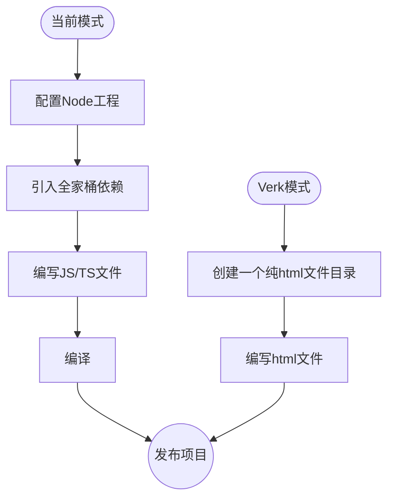
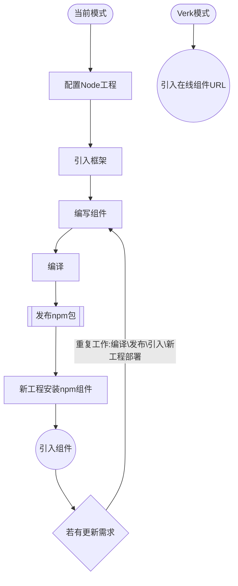
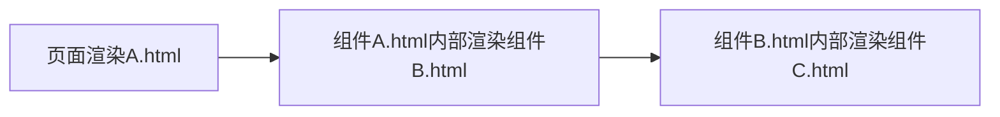

# Welcome Verk

首先恭喜你找到 Verk，它立志提供一个全新的 web 开发方式。

Verk 是一个基于 Web-Components 的前端(`微服务`)框架。Verk 以纯 html 实现一个框架常用的功能，让用户实现一些普通项目时尽可能的少些 JS 代码。

Verk 的核心特点是不需要编译，使用纯 html 进行组织项目。

Verk 把每一个 html 都作为组件进行引用、实例化，并且提供了 props、slot、renderHook 等组件常用的模式。

Verk 内置全局状态管理、路由。

Verk 很轻，仅有 5kb (min + gzip).

Verk 是一个颠覆现有前端开发方式的**尝试**，其实还未准备好在生产环境进行使用。因为一个优秀的工程，还需要解决许多方面的问题，Verk 在错误调试方面并没有任何优势。

## Verk 立志于解决以下问题

- **前端巨石应用:**  Verk是一个天生的前端微服务框架.
- **工程复杂度随迭代增高，处于失控边缘徘徊:**  Verk的设计模式使得我们很容易编写复杂度内聚的工程.
- **前端编译、工程配置繁碎:**  Verk不需要编译，不需要配置工程.
- **跨工程复用组件，频繁发包:**  Verk可以直接使用其他在线Verk工程的模块、组件.
- **非常多重复的代码量:**  Verk可以直接编写HTML标签完成大部分有状态需求的业务逻辑.
- **状态管理过度封装，调试困难:**  Verk直接在标签中嵌入状态管理，并且所有状态都是实时响应的，只有遇到了性能瓶颈时才需要稍加约束.
- **单页面应用切换为多页面应用有一定的工作量:**  Verk是纯html，天生为多页面应用，可以轻松编写多页面混合单页面应用的工程
- **编译后JS资源庞大，即便做了代码拆分:**  Verk天生确保代码拆分，虽然牺牲了代码bundle的加载优势，但是换来了其他更多的特性；现实情况是，很少有应用因为代码拆分的多导致整体性能下降，首屏的性能大部分在于必要依赖过多。


我们看看Verk和当前开发方式的区别:

### 项目开发




### 跨项目公用模块/组件开发

跨项目模块本意是为了节省工作量，让多个项目减少重复开发工作，但是因为需要编译的原因，我们需要重复的做：编译\发布\引入\新工程部署的工作。

而在 Verk 中，我们仅仅需要引入一个其他工程的组件URL即可，若要做版本管理，仅需要使用不同的URL。

下面是一个两个流程对比的图示，我们可以看到减少了大量工作：



### 前端微服务

前端微服务是现在前端讨论的一个热门话题，但是真正实施落地的非常少。追其原因是前端随迭代变得越发复杂，因为有了编译这么一层级，导致于做前端微服务需要考虑的点非常多，其关键的问题在于：
 - 如何公用依赖（减少代码请求量）
 - 如何独立发布部署
 - 如何复用模块
 - 如何拆分微服务粒度，是组件级别还是模块级别

以上所有疑点难点，Verk在结构设计上就提供了解决方案。


# 安装

Verk不推荐使用npm，建议直接在**html文件底部**引入 `<script>` 标签：

```html::{showView:false, style:"height:80px;"}
<script src="https://unpkg.com/verk@0.1.0/umd/index.js"></script>
```

当然，我们如果希望使用自己的CDN，可以将 verk.js 下载到工程中，使用相对路径引入:
```html::{showView:false, style:"height:80px;"}
<script src="./pkg/verk.js"></script>
```
Verk 主张所有src、href路径都以 `./` 开头，以相对路径引入，这在后文使用组件的篇章会有解释。

Verk 的模式是不需要编译、不需要Webpack、npm 组织工程，仅用纯 html 文件进行组合。所以不建议使用 npm 安装。

但是 Verk 的标准 web-component 是可以和大部分前端框架公用的，若你要在 react、vue 中使用 Verk，可以使用npm安装:

```sh::{showView:false, style:"height:80px;"}
$ yarn add verk
```

# 原生组件

Verk 所有功能建立在 Web-components 上，通过组件的组合，代替类似 Vue 的模版语法。

我们一共提供了以下 Web-component：

| Web-component | 是否需要 template 子元素| 描述 |
| :-----| :---- |:---- |
|`<v-txt></v-txt>`| - | 用于动态渲染文本|
|`<v-set></v-set>`| - |用于动态绑定属性、事件|
|`<v-if></v-if>`| - | 用于动态控制内部元素是否存在于 DOM 中|
|`<v-route></v-route>`| - | v-if 的封装，根据URL是否匹配 path，来执行 v-if|
|`<v-show></v-show>`| - | 用于动态控制内部元素是否 display: none|
|`<v-for></v-for>`| - | 用于动态渲染列表|
|`<v-watch></v-watch>`| - | 用于监听组件更新时，做额外的事件|
|`<v-keep></v-keep>`| - | 用于拦截组件更新，当有大列表时，可以使用。一般配合 `<v-set query="..."></v-set>`, 做拦截和定向更新|
|`<v-component></v-component>`| 需要 | 一般用于html的内部创建局部组件|
|`<v-new></v-new>`| 需要 | 用于实例化一个组件、html|
|`<v-preload></v-preload>`| - | 用于预加载深层组件|
|`<v-shadow></v-shadow>`| 需要 | 用于把一个组件内部元素封装在 shadow-root 中，做沙盒处理|


组件内部关键词

| 关键词 | 描述 |
| :-----| :---- |
|**$hook**| 组件实例化时创建的组件内局部变量，内部有一个默认值：state、props、id、dir、el（组件本身）|
|**$verk**| Verk 的工具集合, 大部分情况不需要使用|
|**uuid-**| 每个html文件，内部的 `uuid-` 字符都会在实例化时替换为一个随机id，这可以用规避一些样式污染和组件污染|


## v-txt

v-txt 用于动态渲染文本

**现在你可以修改左侧的源码，实时查看右侧的更新：**

```html::{view:true}
<div>普通计算: <v-txt>100+200</v-txt></div>
<div>字符串拼接: <v-txt>'location.href: '+ location.href</v-txt></div>
<div>任何js计算: <v-txt>document ? 'have document':'no have document'</v-txt></div>
<div>从全局变量中获取值: <v-txt>$hook.state.name</v-txt></div>

<script>
  /* 若在非组件内，如 index.html，需要主动声明 $hook:
  var $hook = {
    state: {
      name:'The dog'
    }
  };
  */

  // $hook 是在每个组件内部的上下文全局变量, 当前交互式教程均是组件内部
  $hook.state = {
    name:'The dog'
  }
</script>
```

## v-set

v-set 用于动态绑定属性、事件, v-set的属性会作用于它的 child，v-set内部仅建议放一个元素。

v-set 设置的属性、事件，都必须是js脚本，其中以on开头的属性，如 onclick、oninput 等等，是一个js函数;而其他属性是一个js值：

```html::{view:true, style:"height:500px"}
<!-- 双向绑定例子： -->
<div>
  <v-txt>$hook.state.name</v-txt>
  <v-set value="$hook.state.name" oninput="e=>$hook.state.name=e.target.value">
    <input placeholder="Plase input" />
  </v-set>
</div>

<div>
  <v-txt>$hook.state.name</v-txt>
  <v-set value="$hook.state.name" type="$hook.state.type" oninput="e=>$hook.state.name=e.target.value">
    <input placeholder="Plase input" />
  </v-set>
</div>

<script>
  $hook.state = {
    type:'password',
    name:'The dog'
  }
</script>
```

## v-if

v-if:  用于动态控制内部元素是否存在于 DOM 中

```html::{view:true, style:"height:300px"}
<div>
  <v-set onclick="()=>$hook.state.show = !$hook.state.show"><button>Change If</button></v-set>
  <v-if value="$hook.state.show">
    <h1>Detail Hello</h1>
  </v-if>
</div>

<script>
  $hook.state = {
    show: false
  }
</script>
```

## v-route

v-route:  用于动态控制内部元素是否存在于 DOM 中

```html::{view:true, style:"height:500px"}
<div>
  <v-set onclick="()=>location.href = '#/home'">
    <button>Go to Home</button>
  </v-set>
  <v-set onclick="()=>location.href = '#/user'">
    <button>Go to User</button>
  </v-set>
  <v-route path="#/home">
    <h1>Home page</h1>
  </v-route>
  <v-route path="#/use">
    <h1>User page</h1>
  </v-route>
</div>
```

## v-show

v-show: 用于动态控制内部元素是否 display: none

```html::{view:true, style:"height:300px"}
<div>
  <v-set onclick="()=>$hook.state.show = !$hook.state.show"><button>Change show</button></v-set>
  <v-show value="$hook.state.show">
    <h1>Detail Hello</h1>
  </v-show>
</div>

<script>
  $hook.state = {
    show: false
  }
</script>
```

## v-for

v-for: 用于动态渲染列表。

v-for 有两个属性，len 和 index，len描述循环的个数，index 描述内部组件引用当前index的字符，index默认是: @i。

v-for 可以嵌套使用。

```html::{view:true, style:"height:500px"}
<div style="background:#f0f0f0;">
  <h3>单个 v-for</h3>
  <v-for len="5">
    <div>hello @i</div>
  <v-for>
</div>

<div style="background:#fff;">
  <h3>多个 v-for</h3>
  <v-for len="5" index="@dog">
    <div>Dog @dog</div>
    <v-for len="5" index="@cat">
      <div>Cat @cat</div>
      <!-- $ 需要转义为 \$ -->
      <v-for len="5" index="\$fish">
        <div>Fish $fish</div>
      <v-for>
    <v-for>
  <v-for>
</div>

```

## v-watch

v-watch: 用于监听组件更新时，做额外的事件。

```html::{view:true, style:"height:500px"}
<div>
  <v-watch value="$hook.state.event"></v-watch>
  <v-set onclick="()=>{}">
    <button>Emit v-watch</button>
  </v-set>
  <div data-list="1"></div>
</div>
<script>
  $hook.state = {
    event: () => {
      const el = document.createElement("div");
      el.textContent = "label";
      document.querySelector("[data-list]").append(el)
    }
  }
</script>
```

## v-keep

v-keep: 用于拦截组件更新，当有大列表时，可以使用。一般配合 `<v-set query="..."></v-set>`, 做拦截和定向更新。

要了解 v-keep 的用途，我们先模拟一个大列表更新的性能问题，我们渲染一个5000长度的列表，并且设定v-txt动态更新内容。
这会导致每次输入都有5000个元素被派发更新，虽然Verk的状态管理性能很高, Verk没有 diff-DOM 开销，直接派发元素对象更新；但是在这种极端条件下我们在输入框输入明显能感觉到页面开始卡顿了。

```html::{view:true, style:"height:300px"}
<div>请编辑左侧的数组长度，把Array(100)改为Array(5000)</div>
<v-for len="$hook.state.list.length">
  <div>item: <v-txt>$hook.state.list[@i]</v-txt></div>
  <v-set oninput="e=>$hook.state.list[@i] = e.target.value">
    <input />
  </v-set>
</v-for>
<script>
  $hook.state = {
    list:Array(100).fill(''),
  };
</script>
```

现在我们使用 `v-keep` 和 `v-set: query` 优化这个案例, 把下面代码拷贝到上面的编辑器中

```html::{view:false, style:"height:300px"}
<div>请编辑左侧的数组长度，把Array(100)改为Array(5000)：</div>
<v-keep>
  <v-for len="$hook.state.list.length">
    <div>item: <v-txt item-@i>$hook.state.list[@i]</v-txt></div>
    <v-set query="[item-@i]" oninput="e=>$hook.state.list[@i] = e.target.value">
      <input />
    </v-set>
  </v-for>
</v-keep>
<script>
  $hook.state = {
    list : Array(100).fill(''),
  };
</script>
```

## v-component / v-new

v-component: 一般用于html的内部创建局部组件.

v-component 用于创建组件，然后使用 v-new 实例化组件

Verk 可以将一个html文件直接当组件使用，大部分情况下我们会使用 html 文件创建组件，而不是 v-component ，v-component仅仅用于在组件内部创建临时用的局部组件。

为了减少组件名污染，我们可用 'uuid-' 字符串进行命名，这样, 内部组件就不会污染外部组件。

Verk 约定组件内第一层请使用 `<template>` 元素包裹，这样的目的是为了隔离组件内包含其他组件，导致嵌套组件在声明时就实例化。

```html::{view:true, style:"height:300px"}
<v-new name="uuid-dog"></v-new>
<v-component name="uuid-dog">
  <template>
    <h1>Title</h1>
    <h3>Label</h3>
  </template>
</v-component>
```

### 引用外部组件

现在有一个 example.html 文件，内容如下：

`<h1><v-txt>$hook.props.title</v-txt></h1>`

`<h3>Label</h3>`

我们引用它，只需要直接输入它的 src 即可，我们还可以传递 props、slot 等功能，和普通的内敛组件一致。

html 组件不需要声明 v-component \ template，在 Verk 的设计中，html 本身就是一个组件内容。

```html::{view:true, style:"height:300px"}
<v-new src="./example.html" props="{title:'the title'}"></v-new>
```

### 使用 slot

我们可以使用类似浏览器 slot 的方式去传递元素到组件中使用, 外部有 slot 属性的元素，会替换内部 slot.name 一致的元素。

Verk约定，组件要传递 slot， 需要使用 `<template>` 包裹元素，其目的是为了 slot 的组件嵌套。

组件内部slot的属性可以被外部元素继承。其中 class 和 style 会做字符串拼接，而其他的属性会被外部元素覆盖:

```html::{view:true, style:"height:300px"}
<v-new name="uuid-dog">
  <template>
    <h1 style="font-size: 14px;" slot="title">Slot Title</h1>
    <h3 slot="label">Slot Label</h3>
  </template>
</v-new>
<v-component name="uuid-dog">
  <template>
    <slot style="color:#00f;" name="title"></slot>
    <slot name="label"></slot>
  </template>
</v-component>
```

### 使用 loading

若有比较大的组件，需要一定的加载过程，我们可以编写 loading 元素，在组件加载时显示，组件加载结束后自动销毁。

我们只要在 template 中添加一个包含 loading 属性的元素即可, 我们还可以为他设定样式，提前做好空间占位。

注意的是，$renderHook 不能在 loading 中识别，因为组件还未加载好，我们无法得知 $hook 的内容。


```html::{view:true, style:"height:300px"}
<v-new name="uuid-dog">
  <template>
    <div loading style="height:100px; width:100px;">Loading...</div>
  </template>
</v-new>
<v-component name="uuid-dog">
  <template>
    <slot style="color:#00f;" name="title"></slot>
    <slot name="label"></slot>
  </template>
</v-component>
```

### 使用 $renderHook

$renderHook 可以获取组件内部 $hook 对象，不过这个功能无法在交互编辑器中演示

```html::{view:false, style:"height:300px"}
<v-new name="uuid-dog">
  <template>
    <h1 style="font-size: 14px;" slot="title">
      <v-txt>$renderHook.state.data</v-txt>
    </h1>
    <h3 slot="label">Slot Label</h3>
  </template>
</v-new>
<v-component name="uuid-dog">
  <template>
    <slot style="color:#00f;" name="title"></slot>
    <slot name="label"></slot>
    <script>
      $hook.state = {
        data: {
          name: 'dog'
        }
      };
    </script>
  </template>
</v-component>
```


## v-preload

v-preload: 用于预加载深层组件。

我们假定有一个这样的结构：



那么Verk的模式是先请求A.html,渲染结束之后再请求B.html,以此类推。

v-preload 就是可以提前并行加载若干个 html 组件，以提供加载效率。


```html::{view:false, style:"height:250px"}
<!-- 并行加载 -->
<v-preload onload="()=>console.log('load')">
  <link rel="verk" href="./example/a.html" />
  <link rel="verk" href="./example/b.html" />
  <link rel="verk" href="./example/c.html" />
</v-preload>
<!-- 渲染 a.html -->
<div>
  <v-new src="./example/a.html"></v-new>
</div>
```


## v-shadow

v-shadow: 用于把一个组件内部元素封装在 shadow-root 沙盒中处理。

我们可以看到，两个局部的样式相互不影响。

```html::{view:true, style:"height:300px"}
<!-- 并行加载 -->
<v-shadow>
  <template>
    <style>
      h2, h3 {
        color: #f00;
      }
    </style>
    <h2>Title</h2>
    <h3>Label</h3>
  </template>
</v-shadow>

<v-shadow>
  <template>
    <style>
      h2, h3 {
        color: #00f;
      }
    </style>
    <h2>Title</h2>
    <h3>Label</h3>
  </template>
</v-shadow>
```

shadow-root很强大，同时也有着自己的特性，失去了一部分便捷性。

我们如果仅仅是为了防止不同组件的样式污染，我们有更简单的建议，在组件或html组件中使用 uuid- 进行样式命名:


```html::{view:true, style:"height:300px"}
<!-- 并行加载 -->
<style>
  .uuid-color {
    color: #f00
  }
</style>
<!-- 在 chrome dev 面板中查看，样式名应该变成了 uxxxxxxx_color -->
<h2 class="uuid-color">Title</h2>
<h3 class="uuid-color">Label</h3>
```

# 在工程中使用

## 创建工程

Verk 的工程就是一个普通的文件夹，不需要 nodejs，不需要安装 npm，回归网页资源原始的组织形式，Verk 会帮我们管理、加载和实例相关资源。

一个 Verk 工程应该是这样：

```text::{showView:false, style:"height: 400px"}
- project/
   - .gitignore
   - pkg
      - verk.js
      - rx.js
      - pdf-editor.js
   - index.html
   - components/
      - nav.html
      - tabbar.html
      - layout.html
      - assets/
        - logo.svg
        - banner.png
   - pages/
     - home.html
     - user.html
     - assets/
        - start.svg
        - avator.png
```

我们可以看到，没有js和css文件，因为我们建议把业务js、css直接内联写在html中, 这点和Vue很接近，而且若用到第三方JS库，直接将其js代码放在工程pkg文件夹中。

Verk 没有打包过程，每个html文件即可以是页面，也可以是组件。

在工程中的文件引用文件，我们推荐用 `./xxx.html` 对相对于当前文件路径的资源进行引用。 Verk 会对引用路径进行处理，以模拟传统工程引用的方式。

值得注意的是，我们仅对 `src` 和 `href` 引用的资源进行处理，不会对其他请求类资源进行处理。

当然我们也可以使用相对于根路径的方式 `/xxx.html` 进行引用，但是这在开发不友好，我们无法在编辑器中点击该路径进行跳转。

## 启动工程

由于没有编译过程，我们仅需要将 index.html 文件拖入浏览器中即可。

当然，如果我们需要开发中同步刷新浏览器，我们可以随便使用一个 server 库启动工程目录:

```sh::{style:"height:80px"}
$ npx live-server ./
```

我们可以将一个 html 下面的一个例子，我们将此文档的 layout.html 进行实力化，并且传递了一个新的 markdown 文件作为参数，渲染当前页面：

## 引用其他工程组件

```html::{view:true, style:""}
<v-new props="{url:'./templates/example_home.md'}" src="./components/app.html">
```

我们可以看到，它并不是一个 iframe，而是渲染了真实的 dom 树，并且它有着自己的生命周期和属性，同时我们有以下几个注意点：

1. 跨应用引用组件，受浏览器同源策略影响，建议配置 nginx 代理，以确保工程同源；若配置 nginx 资源跨域策略，就失去了组件保护，组件可以被其他工程引用。
2. 本网站为了演示，开启了 nginx 资源跨域策略，你可以参考上面代码，直接引用本网站的 layout 组件，并且使用其他 markdown 文件作为参数渲染文档。
3. 请不要在组件内部实例自己，这样会造成循环。

## 安全问题

Verk 大量使用 `new Function`, 虽然它比 `eval` 更安全，但是还是有XSS攻击的风险，在提交数据给后端时需要注意一个原则：永远不要相信用户输入的信息。

<div style="height: 100px"></div>