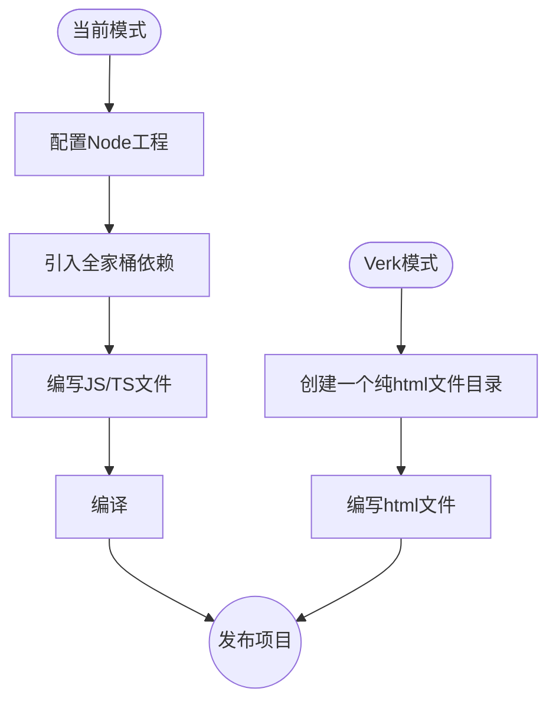
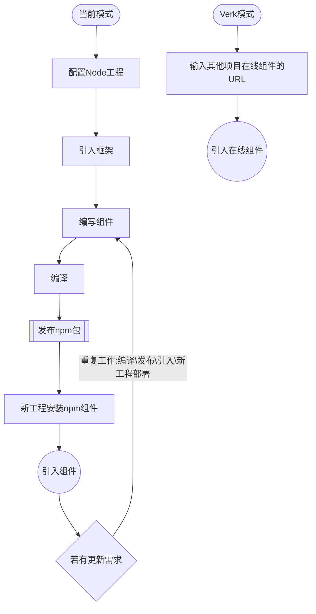

# Why Verk

Verk 是一个基于 Web-Components 的前端(`微服务`)框架。

首先恭喜你找到 [Verk]，它立志提供一个全新的 web 开发方式。

## Verk 立志于解决以下问题

- **前端巨石应用:**  [Verk]是一个天生的前端微服务框架.
- **工程复杂度随迭代增高，处于失控边缘徘徊:**  [Verk]的设计模式使得我们很容易编写复杂度内聚的工程.
- **前端编译、工程配置繁碎:**  [Verk]不需要编译，不需要配置工程.
- **跨工程复用组件，频繁发包:**  [Verk]可以直接使用其他在线[Verk]工程的模块、组件.
- **非常多重复的代码量:**  [Verk]可以直接编写HTML标签完成大部分有状态需求的业务逻辑.
- **状态管理过度封装，调试困难:**  [Verk]直接在标签中嵌入状态管理，并且所有状态都是实时响应的，只有遇到了性能瓶颈时才需要稍加约束.
- **单页面应用切换为多页面应用有一定的工作量:**  [Verk]是纯html，天生为多页面应用，可以轻松编写多页面混合单页面应用的工程
- **编译后JS资源庞大，即便做了代码拆分:**  [Verk]天生确保代码拆分，虽然牺牲了代码bundle的加载优势，但是换来了其他更多的特性；现实情况是，很少有应用因为代码拆分的多导致整体性能下降，首屏的性能大部分在于必要依赖过多。


我们看看Verk和当前开发方式的区别:

### 项目开发




### 跨项目公用模块/组件开发

跨项目模块本意是为了节省工作量，让多个项目减少重复开发工作，但是因为需要编译的原因，我们需要重复的做：编译\发布\引入\新工程部署的工作。

而在 [Verk] 中，我们仅仅需要引入一个其他工程的组件URL即可，若要做版本管理，仅需要使用不同的URL。

下面是一个两个流程对比的图示：



### 前端微服务

前端微服务是现在前端讨论的一个热门话题，但是真正实施落地的非常少。追其原因是前端随迭代变得越发复杂，因为有了编译这么一层级，导致于做前端微服务需要考虑的点非常多，其关键的问题在于：
 - 如何公用依赖（减少代码请求量）
 - 如何独立发布部署
 - 如何复用模块
 - 如何拆分微服务粒度，是组件级别还是模块级别

以上所有疑点难点，[Verk]在结构设计上就提供了解决方案。


# 安装

我们仅推荐一种方式安装，就是在**html文件底部**引入 `<script>` 标签：

```html::{showView:false, style:"height:80px;"}
<script src="https://unpkg.com/verk@0.1.0/umd/index.js"></script>
```

当然，我们如果希望使用自己的CDN，可以将 verk.js 下载到工程中，使用相对路径引入:
```html::{showView:false, style:"height:80px;"}
<script src="./pkg/verk.js"></script>
```

[Verk] 主张所有src、href路径都以 `./` 开头，以相对路径引入，这在后文使用组件的篇章会有解释。

# 原生组件

[Verk] 所有功能建立在 Web-components 上，通过组件的组合，代替类似 Vue 的模版语法。

我们一共提供了以下 Web-component：

| Web-component | 描述 |
| :-----| :---- |
|`<v-txt></v-txt>`| 用于动态渲染文本|
|`<v-set></v-set>`| 用于动态绑定属性、事件|
|`<v-if></v-if>`| 用于动态控制内部元素是否存在于 DOM 中|
|`<v-route></v-route>`| v-if 的封装，根据URL是否匹配 path，来执行 v-if|
|`<v-show></v-show>`| 用于动态控制内部元素是否 display: none|
|`<v-for></v-for>`| 用于动态渲染列表|
|`<v-watch></v-watch>`| 用于监听组件更新时，做额外的事件|
|`<v-keep></v-keep>`| 用于拦截组件更新，当有大列表时，可以使用。一般配合 `<v-set query="..."></v-set>`, 做拦截和定向更新|
|`<v-component></v-component>`| 一般用于html的内部创建局部组件|
|`<v-new></v-new>`| 用于实例化一个组件、html|
|`<v-preload></v-preload>`| 用于预加载深层组件|
|`<v-shadow></v-shadow>`| 用于把一个组件内部元素封装在 shadow-root 中，做沙盒处理|


组件内部关键词

| 关键词 | 描述 |
| :-----| :---- |
|**$hook**| 组件实例化时创建的全局变量，内部有一个默认值：props、id、dir、el（组件本身）|
|**$verk**| [Verk] 的工具集合, 大部分情况不需要使用|
|**verk-**| 每个html文件，内部的 `verk-` 字符都会在实例化时替换为一个随机id，这可以用规避一些样式污染|


## v-txt

v-txt 用于动态渲染文本

**现在你可以修改左侧的源码，实时查看右侧的更新：**

```html::{view:true}
<div>普通计算: <v-txt>100+200</v-txt></div>
<div>字符串拼接: <v-txt>'location.href: '+ location.href</v-txt></div>
<div>任何js计算: <v-txt>document ? 'have document':'no have document'</v-txt></div>
<div>从全局变量中获取值: <v-txt>$hook.name</v-txt></div>

<script>
  // $hook 是在每个组件内部的上下文全局变量
  $hook = {
    name:'The dog'
  }
</script>
```

## v-set

v-set 用于动态绑定属性、事件, v-set的属性会作用于它的 child，v-set内部仅建议放一个元素。

v-set 设置的属性、事件，都必须是js脚本，其中以on开头的属性，如 onclick、oninput 等等，是一个js函数;而其他属性是一个js值：

```html::{view:true, style:"height:500px"}
<!-- 双向绑定例子： -->
<div>
  <v-txt>$hook.name</v-txt>
  <v-set value="$hook.name" oninput="e=>$hook.name=e.target.value">
    <input placeholder="Plase input" />
  </v-set>
</div>

<div>
  <v-txt>$hook.name</v-txt>
  <v-set value="$hook.name" type="$hook.type" oninput="e=>$hook.name=e.target.value">
    <input placeholder="Plase input" />
  </v-set>
</div>

<script>
  $hook = {
    type:'password',
    name:'The dog'
  }
</script>
```

## v-if

v-if:  用于动态控制内部元素是否存在于 DOM 中

```html::{view:true, style:"height:300px"}
<div>
  <v-set onclick="()=>$hook.show = !$hook.show"><button>Change If</button></v-set>
  <v-if value="$hook.show">
    <h1>Detail Hello</h1>
  </v-if>
</div>

<script>
  $hook = {
    show: false
  }
</script>
```

## v-route

v-route:  用于动态控制内部元素是否存在于 DOM 中

```html::{view:true, style:"height:500px"}
<div>
  <v-set onclick="()=>location.href = '#/home'">
    <button>Go to Home</button>
  </v-set>
  <v-set onclick="()=>location.href = '#/user'">
    <button>Go to User</button>
  </v-set>
  <v-route path="#/home">
    <h1>Home page</h1>
  </v-route>
  <v-route path="#/use">
    <h1>User page</h1>
  </v-route>
</div>

<script>
  $hook = {
    show: false
  }
</script>
```

## v-show

v-show: 用于动态控制内部元素是否 display: none

```html::{view:true, style:"height:300px"}
<div>
  <v-set onclick="()=>$hook.show = !$hook.show"><button>Change show</button></v-set>
  <v-show value="$hook.show">
    <h1>Detail Hello</h1>
  </v-show>
</div>

<script>
  $hook = {
    show: false
  }
</script>
```

## v-for

v-for: 用于动态渲染列表。

v-for 有两个属性，len 和 index，len描述循环的个数，index 描述内部组件引用当前index的字符，index默认是: @i。

v-for 可以嵌套使用。

```html::{view:true, style:"height:500px"}
<div style="background:#f0f0f0;">
  <h3>单个 v-for</h3>
  <v-for len="5">
    <div>hello @i</div>
  <v-for>
</div>

<div style="background:#fff;">
  <h3>多个 v-for</h3>
  <v-for len="5" index="@dog">
    <div>Dog @dog</div>
    <v-for len="5" index="@cat">
      <div>Cat @cat</div>
      <!-- $ 需要转义为 \$ -->
      <v-for len="5" index="\$fish">
        <div>Fish $fish</div>
      <v-for>
    <v-for>
  <v-for>
</div>

```

## v-watch

v-watch: 用于监听组件更新时，做额外的事件。

```html::{view:true, style:"height:500px"}
<div>
  <v-watch value="$hook.event"></v-watch>
  <v-set onclick="()=>{}">
    <button>Emit v-watch</button>
  </v-set>
  <div data-list="1"></div>
</div>
<script>
  $hook = {
    event: () => {
      const el = document.createElement("div");
      el.textContent = "label";
      document.querySelector("[data-list]").append(el)
    }
  }
</script>
```


# 在工程中使用

### 创建工程

> **接下来工程相关的概念对于当前篇幅有些超前，仅仅是先让我们对 [Verk] 有一个印象。**

[Verk] 的工程就是一个普通的文件夹，不需要 nodejs，不需要安装 npm，回归网页资源原始的组织形式，[Verk] 会帮我们管理、加载和实例相关资源。

一个 Verk 工程应该是这样：

```text::{showView:false, style:"height: 400px"}
- project/
   - .gitignore
   - pkg
      - verk.js
      - rx.js
      - pdf-editor.js
   - index.html
   - components/
      - nav.html
      - tabbar.html
      - layout.html
      - assets/
        - logo.svg
        - banner.png
   - pages/
     - home.html
     - user.html
     - assets/
        - start.svg
        - avator.png
```

我们可以看到，没有js和css文件，因为我们建议把业务js、css直接内联写在html中, 这点和Vue很接近，而且若用到第三方JS库，直接将其js代码放在工程pkg文件夹中。

[Verk] 没有打包过程，每个html文件即可以是页面，也可以是组件。

### 启动工程

由于没有编译过程，我们仅需要将 index.html 文件拖入浏览器中即可。

当然，如果我们需要开发中同步刷新浏览器，我们可以随便使用一个 server 库启动工程目录:

```sh::{style:"height:80px"}
$ npx live-server ./
```

我们可以将一个 html 下面的一个例子，我们将此文档的 layout.html 进行实力化，并且传递了一个新的 markdown 文件作为参数，渲染当前页面：

### 引用其他工程组件

```html::{view:true, style:""}
<v-new props="{url:'./templates/example_home.md'}" src="http://verk.writeflowy.com/components/layout.html">
```

我们可以看到，它并不是一个 iframe，而是渲染了真实的 dom 树，并且它有着自己的生命周期和属性，同时我们有以下几个注意点：

1. 跨应用引用组件，受浏览器同源策略影响，建议配置 nginx 代理，以确保工程同源；若配置 nginx 资源跨域策略，就失去了组件保护，组件可以被其他工程引用。
2. 本网站为了演示，开启了 nginx 资源跨域策略，你可以参考上面代码，直接引用本网站的 layout 组件，并且使用其他 markdown 文件作为参数渲染文档。
3. 请不要在组件内部实例自己，这样会造成循环。


## How To Use The Demo


| 左对齐 | 右对齐 | 居中对齐 |
| :-----| ----: | :----: |
| 单元格 | 单元格 | 单元格 |
| 单元格 | 单元格 | 单元格 |

1. Type in stuff on the left.
2. See the live updates on the right.

That's it.  Pretty simple.  There's also a drop-down option in the upper right to switch between various views:

- **Preview:**  A live display of the generated HTML as it would render in a browser.
- **HTML Source:**  The generated HTML before your browser makes it pretty.
- **Lexer Data:**  What [marked] uses internally, in case you like gory stuff like this.
- **Quick Reference:**  A brief run-down of how to format things using markdown.

### Why Markdown?


It's easy.  It's not overly bloated, unlike HTML.  Also, as the creator of [markdown] says,

> The overriding design goal for Markdown's
> formatting syntax is to make it as readable
> as possible. The idea is that a
> Markdown-formatted document should be
> publishable as-is, as plain text, without
> looking like it's been marked up with tags
> or formatting instructions.

Ready to start writing?  Either start changing stuff on the left or
[clear everything](/demo/?text=) with a simple click.

[Marked]: https://github.com/markedjs/marked/
[Markdown]: http://daringfireball.net/projects/markdown/
[Verk]: https://github.com/ymzuiku/verk


```html
<v-new name="dog"></v-new>
<v-set oninput="e=>$hook.state.hello = e.target.value">
  <input>
</v-set>
<v-txt>$hook.state.hello</v-txt>
<v-component>
<div show="$hook.state.hello">hello verk</div>
  <script>
    $hook.state = {
      hello: true,
    };
  </script>
</v-component>
```
